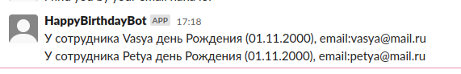

## Скрипт-бот для Slack

С момента запуска бот запрашивает из стороннего айпи информацию о руководителях и сотрудниках, у которых сегодня
день рождения. После отправляет информацию (ФИО, дата рождения, почта) руководителю в личные сообщения.

## Начало работы

Для начала работы нужно зарегистрировать приложение на сайте [Slack](https://api.slack.com/). Далее создать бота и добавить в его рабочее пространство.
В разделе OAuth выдать права на чтение пользователей,
чтение почты пользователей и права на отправку сообщений.

После добавления бота в рабочее пространство сгенерируется Access token, который нужно добавить в скрипт, в файл consts.ts

В самом конце остается задеплоить скрипт на сервер.

## Скрипты

- `npm run start` - Запуск скрипта на сервере
- `npm run build` - сборка проекта из Typescript в Javascript

## Пример сообщения от бота

## Алгоритм работы скрипта

1. Запрашивается информация со стороннего Api о руководителях и сотрудниках.
2. Если массив не пустой, проходимся по каждому элементу, где запрашиваем Айди руководителя в слаке.
3. Если айди руководителя корректный, вызываем функцию подготовки сообщения и передаем в неё массив сотрудников.
4. Проходимся по массиву сотрудников. Если массив не пустой, готовим сообщение для отправки.
5. Отправляем личное сообщение руководителю от бота с информацией о сотрудниках.

Скрипт повторяется каждые 24 часа.
